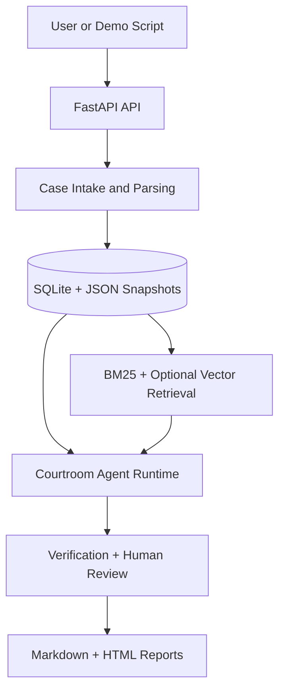

# AI Courtroom Harness

AI Courtroom Harness is a Vietnamese legal simulation backend for structured case intake, legal retrieval, multi-agent courtroom flow, verification, human review, and formal report export.

The project is built as an agent harness, not a free-form chatbot. Each case moves through explicit stages, leaves inspectable artifacts, and keeps all generated outcomes non-binding.

## Status

- Backend MVP: complete
- V1 backend harness: complete through report hooks and evaluation
- Frontend/UI: pending in `apps/web`
- Supported case family: `civil_contract_dispute`

## Architecture



## Features

- Case creation, attachment upload, metadata parsing, and basic PDF/text extraction
- Local BM25 legal retrieval with optional Colab/ngrok vector retrieval
- Provider-aware LLM abstraction with heuristic fallback
- MVP courtroom flow with plaintiff, defense, judge, clerk, fact-check, and citation verification
- V1 stage-based hearing runtime with evidence challenges, clarification rounds, and non-binding proposed outcomes
- Markdown and HTML report exports for MVP and V1 hearing records
- CPU-friendly smoke tests and scripted demo flows

## Repository Layout

```text
apps/api/          FastAPI backend and persistence hooks
apps/web/          frontend placeholder
packages/shared/   Pydantic schemas, TypeScript types, fixtures
packages/retrieval/ legal corpus, BM25 search, vector bridge
packages/orchestration/ MVP and V1 courtroom runtimes
packages/verification/ audit, claim, citation, review checks
packages/reporting/ markdown and HTML renderers
scripts/           ingest, setup, eval, demo scripts
docs/              architecture, setup, benchmark, migration notes
data/              local generated artifacts, ignored by git
```

## Quickstart

Use a repo-local virtual environment.

```powershell
py -3.12 -m venv .venv
.\.venv\Scripts\python.exe -m pip install -e .
```

Run the API:

```powershell
cd apps/api
..\..\.venv\Scripts\python.exe -m uvicorn app.main:app --reload
```

Run the scripted MVP demo without starting a server:

```powershell
.\scripts\demos\run_demo.ps1
```

Optional HTML preview:

```powershell
.\scripts\demos\run_demo.ps1 -OpenPreview
```

## Smoke Tests

Run from the repository root.

```powershell
.\.venv\Scripts\python.exe -m compileall apps packages scripts\eval
.\.venv\Scripts\python.exe scripts\eval\smoke_case_intake.py
.\.venv\Scripts\python.exe scripts\eval\smoke_legal_search.py
.\.venv\Scripts\python.exe scripts\eval\smoke_simulation.py
.\.venv\Scripts\python.exe scripts\eval\smoke_review_export.py
```

V1 backend checks:

```powershell
.\.venv\Scripts\python.exe scripts\eval\smoke_v1_hearing_runtime.py
.\.venv\Scripts\python.exe scripts\eval\smoke_v1_eval_cases.py
.\.venv\Scripts\python.exe scripts\eval\smoke_v1_negative_guards.py
```

## Main API Surfaces

- `POST /api/v1/cases`
- `POST /api/v1/cases/{case_id}/attachments`
- `POST /api/v1/cases/{case_id}/parse`
- `POST /api/v1/legal-search`
- `POST /api/v1/cases/{case_id}/simulate`
- `POST /api/v1/cases/{case_id}/review`
- `POST /api/v1/reports/{case_id}/markdown`
- `POST /api/v1/cases/{case_id}/hearing/start`
- `POST /api/v1/cases/{case_id}/hearing/advance`
- `GET /api/v1/cases/{case_id}/hearing`
- `GET /api/v1/cases/{case_id}/evidence/challenges`
- `GET /api/v1/cases/{case_id}/verification`
- `GET /api/v1/cases/{case_id}/outcome`
- `POST /api/v1/cases/{case_id}/hearing/record/markdown`
- `POST /api/v1/cases/{case_id}/hearing/record/html`

## LLM And Retrieval Configuration

Provider keys and the optional Colab vector URL can be stored in ignored `.env.local`:

```powershell
.\.venv\Scripts\python.exe scripts\setup\configure_provider_cli.py
```

Default MVP provider chain:

```text
openrouter / inclusionai/ring-2.6-1t:free
-> groq / qwen/qwen3-32b
-> heuristic fallback
```

Supported explicit providers include OpenRouter, Groq, DeepSeek, NVIDIA NIM, 9Router, and Ollama Cloud. See `docs/MODEL_BENCHMARKS.md` for tested models and tradeoffs.

For hybrid retrieval, run the Colab vector service and set:

```powershell
$env:AI_COURT_VECTOR_API_URL="https://your-ngrok-url"
```

The backend falls back to BM25 if the remote vector service is unavailable.

## Key Documents

- `IMPLEMENTATION_PLAN.md`: original MVP plan
- `V1_IMPLEMENTATION_PLAN.md`: V1 scope and phase status
- `docs/architecture/MVP_ARCHITECTURE.md`: current architecture notes
- `docs/COLAB_VECTOR_SETUP.md`: Colab vector retrieval setup
- `docs/MODEL_BENCHMARKS.md`: provider benchmark notes
- `apps/web/FRONTEND_MVP_PLAN.md`: frontend handoff plan

## Disclaimer

This project is for legal education, simulation, and research support only. It does not provide legal advice, official judgments, or a replacement for qualified legal professionals.
