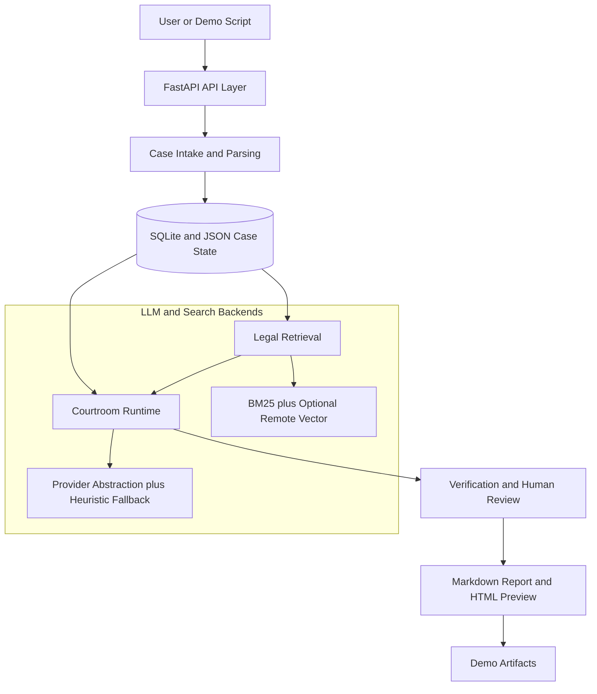

# AI Courtroom Harness

`AI Courtroom Harness` is a Vietnamese legal decision-support and courtroom-simulation MVP.

This repo is no longer just a Phase 0 skeleton. It now includes:

- structured case intake and evidence extraction
- legal retrieval with BM25 + optional remote vector fusion
- a multi-agent courtroom runtime
- verification and human review gates
- markdown + HTML report export
- a scripted demo flow that runs end-to-end without a separate frontend

The current MVP focus is narrow by design:

- one case family: `civil_contract_dispute`
- harness-first runtime instead of a generic chatbot
- evidence-grounded and citation-aware outputs
- human review before final export

## MVP Status

Backend and harness scope are largely complete for the original MVP plan.

- Done: shared contracts, retrieval baseline, case intake, simulation runtime, verification, review gate, report export, provider abstraction, scripted demo flow
- Not done: the real frontend workspace in `apps/web`
- Still optional: PDF export and broader product polish

Strictly against `IMPLEMENTATION_PLAN.md`, the repo is **not fully finished** because the UI lane is still open and `Milestone F` remains unchecked. But if you exclude UI, the backend MVP and agent-harness path are already in a usable demo state.

## Architecture Preview

Mermaid source for the current MVP architecture lives in:

- `docs/architecture/MVP_ARCHITECTURE.md`



## What The Harness Does

This repo is built as an **agent harness**, not as a free-form legal chatbot.

The harness enforces:

- fixed agent roles: retrieval, plaintiff, defense, judge, clerk
- structured claims, evidence links, and citation links
- verification after simulation, not just raw generation
- human review before final `report_ready`

That means the system does not simply answer a prompt. It moves a case through a controlled pipeline where each stage leaves inspectable artifacts.

## Courtroom Flow

```text
case input
-> attachment parsing
-> facts + evidence + legal issues
-> legal retrieval
-> plaintiff turn
-> defense turn
-> judge summary
-> clerk report draft
-> verification + audit trail
-> human review gate
-> markdown report
-> HTML preview
```

## MVP Architecture In Plain Terms

The current repo is organized into four backend planes plus one pending UI lane:

- `Intake plane`: ingest case text and attachments, parse them into facts, evidence, and legal issues, then persist state in SQLite plus JSON snapshots
- `Retrieval plane`: combine BM25 local legal search with optional remote vector search from Colab
- `Runtime plane`: run a role-constrained courtroom flow through plaintiff, defense, judge, and clerk
- `Verification plane`: reject unsupported claims, flag bad citations, record audit events, and block risky cases behind human review
- `Reporting plane`: export markdown and render a formal HTML preview for demo use

The only major MVP lane still pending is the real frontend in `apps/web`.

## Agent Harness Tech

- `FastAPI`: API surface and local backend runtime
- `Pydantic`: source-of-truth schemas for contracts and state
- `LangGraph`: linear multi-agent courtroom orchestration
- `BM25 + remote vector fusion`: legal retrieval baseline
- `SQLite + JSON snapshots`: local persistence for cases and reports
- `Verification layer`: unsupported-claim checks, citation verification, contradiction flags, review gating
- `Provider abstraction`: OpenRouter, Groq, DeepSeek, NVIDIA NIM, 9Router, Ollama Cloud, plus heuristic fallback

## What Gets Generated

For each case, the runtime produces structured artifacts rather than only prose:

- `facts`
- `evidence`
- `legal_issues`
- `claims`
- `citations`
- `agent_turns`
- `judge_summary`
- `trial_minutes`
- `audit_trail`
- `human_review`
- `final_report`

## Workspace Layout

```text
apps/
  api/         FastAPI backend for intake, simulation, verification, and reports
  web/         frontend workspace placeholder, still not implemented
packages/
  shared/      shared schemas and fixtures
  retrieval/   retrieval baseline, corpus resources, vector bridge, and ingest helpers
  orchestration/ LangGraph runtime and provider-aware agent generation
  verification/ harness checks, audit trail, and human review gating
  reporting/   markdown and HTML report rendering
data/
  raw/
  processed/
  indexes/
scripts/
  ingest/
  eval/
  demos/
docs/
  architecture/
  prompts/
  eval/
```

## Core Packages

- `packages/shared/python/ai_court_shared/schemas.py`: canonical domain schema layer
- `packages/retrieval/python/ai_court_retrieval/service.py`: BM25 + remote vector hybrid retrieval
- `packages/orchestration/python/ai_court_orchestration/service.py`: courtroom graph runtime
- `packages/orchestration/python/ai_court_orchestration/llm.py`: provider abstraction and fallback chain
- `packages/verification/python/ai_court_verification/service.py`: safety and review controls
- `packages/reporting/python/ai_court_reporting/service.py`: markdown + HTML report rendering

## FastAPI Endpoints

- `GET /health`
- `GET /api/v1/fixtures/sample-case`
- `GET /api/v1/cases`
- `POST /api/v1/cases`
- `GET /api/v1/cases/{case_id}`
- `POST /api/v1/cases/{case_id}/attachments`
- `POST /api/v1/cases/{case_id}/parse`
- `GET /api/v1/cases/{case_id}/state`
- `GET /api/v1/cases/{case_id}/audit`
- `POST /api/v1/legal-search`
- `POST /api/v1/cases/{case_id}/simulate`
- `POST /api/v1/cases/{case_id}/hearing/start`
- `POST /api/v1/cases/{case_id}/hearing/advance`
- `GET /api/v1/cases/{case_id}/hearing`
- `GET /api/v1/cases/{case_id}/evidence/challenges`
- `GET /api/v1/cases/{case_id}/verification`
- `GET /api/v1/cases/{case_id}/outcome`
- `POST /api/v1/cases/{case_id}/review`
- `GET /api/v1/reports/{case_id}`
- `POST /api/v1/reports/{case_id}/markdown`
- `GET /api/v1/reports/{case_id}/markdown`

- `POST /api/v1/cases` now persists draft case input to a local SQLite store and writes case snapshots to `data/processed/cases/<case_id>/case.json`
- `GET /api/v1/cases` lists locally created cases from the persistence layer
- `GET /api/v1/cases/{case_id}` returns draft input plus the latest parsed state when available
- `POST /api/v1/cases/{case_id}/attachments` uploads a local attachment into `data/raw/cases/<case_id>/attachments/` and resets the case back to `draft` until it is parsed again
- `POST /api/v1/cases/{case_id}/parse` now runs a local heuristic parser and persists `parsed.json`
- `GET /api/v1/cases/{case_id}/state` returns the stored parsed case state for frontend consumption
- `GET /api/v1/cases/{case_id}/audit` returns the persisted audit trail and human review gate
- `POST /api/v1/cases/{case_id}/simulate` now runs a LangGraph-based courtroom simulation flow over the parsed case state
- `POST /api/v1/cases/{case_id}/hearing/start` starts the V1 stage-based hearing runtime over the parsed case state
- `POST /api/v1/cases/{case_id}/hearing/advance` advances the V1 hearing by one validated procedural stage
- `GET /api/v1/cases/{case_id}/hearing` returns the persisted V1 hearing session snapshot
- `POST /api/v1/cases/{case_id}/review` resolves the human review gate and can move a case from `review_required` to `report_ready`
- `GET /api/v1/reports/{case_id}` now returns the latest stored simulation report when available, and falls back to the fixture only for the sample case without a local simulation snapshot
- `POST /api/v1/reports/{case_id}/markdown` exports a persisted markdown report once the case is `report_ready`
- `GET /api/v1/reports/{case_id}/markdown` reads the stored markdown export for the case
- `POST /api/v1/legal-search` uses the retrieval baseline over the MVP legal corpus
- Attachment parsing is CPU-friendly and supports metadata parsing for all attachments plus best-effort local text extraction for PDF and text files when `local_path` is provided

## Shared Contracts

Python schemas:

- `packages/shared/python/ai_court_shared/schemas.py`

TypeScript types:

- `packages/shared/types/index.ts`

## Sample Fixtures

- `packages/shared/fixtures/sample_case_01.case.json`
- `packages/shared/fixtures/sample_case_01.create.response.json`
- `packages/shared/fixtures/sample_case_01.parse.json`
- `packages/shared/fixtures/sample_case_01.report.json`
- `packages/shared/fixtures/sample_case_01.simulation.json`

## Retrieval Baseline

- Real MVP corpus: `packages/retrieval/python/ai_court_retrieval/resources/mvp_legal_corpus.json`
- Fallback seed corpus: `packages/retrieval/python/ai_court_retrieval/resources/seed_legal_corpus.json`
- Search service: `packages/retrieval/python/ai_court_retrieval/service.py`
- Ingest helper: `scripts/ingest/build_legal_corpus.py`
- Smoke eval: `scripts/eval/smoke_legal_search.py`
- Optional full-corpus dependency: install `datasets` inside `.venv` before running the ingest helper
- Remote vector setup guide: `docs/COLAB_VECTOR_SETUP.md`

Run a retrieval smoke check from the repo root:

```bash
.\.venv\Scripts\python scripts/eval/smoke_legal_search.py
```

To enable hybrid search without running the embedding model on your laptop, set:

```powershell
$env:AI_COURT_VECTOR_API_URL="https://your-colab-ngrok-url"
```

The local API will then merge BM25 with remote vector results from Colab and fall back to BM25-only if the remote service is unavailable.

You can also store the Colab/ngrok URL persistently with the provider config CLI:

```powershell
.\.venv\Scripts\python.exe scripts\setup\configure_provider_cli.py
```

Choose `Configure Colab vector URL` and paste the current ngrok URL from Colab.

## Run API Mock

```bash
uvicorn app.main:app --reload
```

Run from:

```text
apps/api
```

## Phase 2 Smoke Check

The Phase 2 baseline is CPU-only and does not require a GPU. Run:

```bash
.\.venv\Scripts\python scripts/eval/smoke_case_intake.py
```

This creates a draft case, uploads a PDF attachment, parses it into facts, evidence, and legal issues, and writes the artifacts to `data/processed/cases/`.

## Phase 3 Smoke Check

The Phase 3 simulation runtime is also CPU-only. Run:

```bash
.\.venv\Scripts\python scripts/eval/smoke_simulation.py
```

This drives `create -> upload attachment -> parse -> simulate -> report` through the FastAPI app and verifies that the LangGraph-based multi-agent flow produces structured claims, turns, minutes, and a final report.

## LLM Providers

The courtroom runtime now supports a provider abstraction for text generation in the
`plaintiff`, `defense`, `judge`, and `clerk` stages while preserving heuristic fallback.

Persistent local provider config:

```powershell
.\.venv\Scripts\python.exe scripts\setup\configure_provider_cli.py
```

This menu stores provider settings in repo-local `.env.local`, which is ignored by git.
The runtime automatically loads `.env.local` before reading provider variables, so you no longer
need to re-enter `$env:...` values in every new PowerShell window.

OpenRouter setup:

```powershell
$env:AI_COURT_LLM_PROVIDER="openrouter"
$env:OPENROUTER_API_KEY="your_key_here"
$env:OPENROUTER_MODEL="inclusionai/ring-2.6-1t:free"
```

Groq setup:

```powershell
$env:AI_COURT_LLM_PROVIDER="groq"
$env:GROQ_API_KEY="your_key_here"
$env:GROQ_MODEL="qwen/qwen3-32b"
```

DeepSeek setup:

```powershell
$env:AI_COURT_LLM_PROVIDER="deepseek"
$env:DEEPSEEK_API_KEY="your_key_here"
$env:DEEPSEEK_MODEL="deepseek-v4-pro"
$env:DEEPSEEK_THINKING="disabled"
```

The DeepSeek integration uses the OpenAI-compatible endpoint at `https://api.deepseek.com`
and enables JSON output mode for the repo's strict structured-generation contract. The
current `deepseek-v4-pro` discount is applied by DeepSeek billing when this model is used
through their API; there is no repo-side discount flag to set. Check the official pricing
page before paid runs: `https://api-docs.deepseek.com/quick_start/pricing/`.

For MVP simulations, `DEEPSEEK_THINKING` defaults to `disabled` because DeepSeek enables
thinking by default and that made the short JSON agent calls much slower. Set
`DEEPSEEK_THINKING=enabled` and optionally `DEEPSEEK_REASONING_EFFORT=high` or `max` only
when you want slower, deeper reasoning experiments. The orchestration layer also sets tighter
per-task output budgets for DeepSeek-backed JSON calls: short role turns and report summaries
use smaller budgets than judge summaries.

DeepSeek feature notes:

- Multi-round chat is stateless; the current runtime intentionally keeps each agent call independent instead of replaying full conversation history.
- Context caching is automatic on DeepSeek's side and benefits repeated shared prefixes without extra repo config.
- Chat prefix completion and FIM require the beta endpoint, so they are not used in the MVP courtroom JSON path.
- Tool calls are useful for model-directed tool use, but this repo keeps retrieval and verification deterministic outside the model for safer demos.

NVIDIA NIM setup:

```powershell
$env:AI_COURT_LLM_PROVIDER="nvidia"
$env:NVIDIA_API_KEY="your_key_here"
$env:NVIDIA_MODEL="z-ai/glm4.7"
```

The NVIDIA integration uses the official OpenAI-compatible client against
`https://integrate.api.nvidia.com/v1`. The current repo path uses non-streaming JSON responses
because the courtroom runtime expects strict structured JSON at each agent step.

9Router setup:

```powershell
$env:AI_COURT_LLM_PROVIDER="9router"
$env:NINEROUTER_URL="http://localhost:20128"
$env:NINEROUTER_KEY="your_key_here"
$env:NINEROUTER_MODEL="cx/gpt-5.2"
```

Ollama Cloud setup:

```powershell
$env:AI_COURT_LLM_PROVIDER="ollama"
$env:OLLAMA_API_KEY="your_key_here"
$env:OLLAMA_MODEL="deepseek-v4-flash:cloud"
```

Some Ollama Cloud models require an eligible subscription tier. In testing, `deepseek-v4-flash:cloud`
returned `403 requires a subscription` on the provided key, so the runtime falls back to the heuristic
path instead of failing the whole simulation.

If `AI_COURT_LLM_PROVIDER` is left as `auto`, the runtime currently prefers OpenRouter when
`OPENROUTER_API_KEY` is present, otherwise Groq when `GROQ_API_KEY` is present, and otherwise
falls back to the deterministic heuristic path.

`deepseek`, `nvidia`, `9router`, and `ollama` are supported as explicit providers, but they are
not part of the default MVP auto-chain.

Recommended MVP fallback chain:

```text
primary:   openrouter / inclusionai/ring-2.6-1t:free
fallback:  groq / qwen/qwen3-32b
final:     heuristic
```

The provider layer now retries the Groq fallback automatically when the preferred OpenRouter route
fails, for example because of `429` rate limiting on the free tier.

Optional model override:

```powershell
$env:OPENROUTER_MODEL="tencent/hy3-preview"
```

For one-off tests, keep API keys in the current shell. For repeat local runs, use
`scripts/setup/configure_provider_cli.py`; it writes keys only to ignored `.env.local`.

Quick provider smoke:

```bash
.\.venv\Scripts\python scripts/eval/smoke_openrouter_provider.py
```

Benchmark notes and recommended models:

- `docs/MODEL_BENCHMARKS.md`
- MVP default pair:
  - OpenRouter: `inclusionai/ring-2.6-1t:free`
  - Groq: `qwen/qwen3-32b`
  - Optional paid provider: `deepseek / deepseek-v4-pro`
  - Optional detailed-but-slower provider: `nvidia / z-ai/glm4.7`
  - Optional explicit provider: `9router / cx/gpt-5.2`

## Phase 4 Safety Check

The same simulation smoke now also verifies:

- audit trail creation
- unsupported claim and citation checks
- human review gate activation

## V1 Hearing Runtime Smoke

The V1 procedural runtime is CPU-only and advances a parsed case through stage-based hearing steps:

```powershell
.\.venv\Scripts\python.exe scripts\eval\smoke_v1_hearing_runtime.py
```

This verifies `hearing/start -> hearing/advance -> hearing` and persists `data/processed/cases/<case_id>/hearing_v1.json`.
- report status transitioning to `review_required` when risks remain

## Phase 5 Backend Check

The Phase 5 backend additions are still CPU-only. Run:

```bash
.\.venv\Scripts\python scripts/eval/smoke_review_export.py
```

This drives `create -> upload attachment -> parse -> simulate -> review approve -> markdown export`
and verifies that the review gate can be resolved into `report_ready` before exporting
`data/processed/cases/<case_id>/report.md`.

## Scripted Demo Flow

Run the MVP demo end-to-end without starting the API server manually:

```powershell
.\scripts\demos\run_demo.ps1
```

Optional browser preview:

```powershell
.\scripts\demos\run_demo.ps1 -OpenPreview
```

This scripted flow uses the in-repo FastAPI app through `TestClient`, creates a demo case,
exports `report.md`, and generates `report_preview.html` under
`data/processed/cases/<case_id>/`.

You do not need to start the local API in another terminal for `run_demo.ps1`.
It uses `TestClient` directly inside the script.

If you want hybrid retrieval instead of BM25-only during the demo, keep the Google Colab
vector server alive and make sure `AI_COURT_VECTOR_API_URL` is saved in `.env.local`
or set in the current shell.
