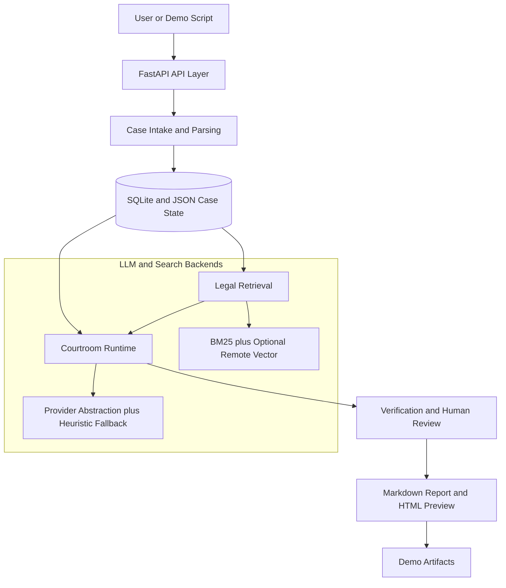

# Current MVP Architecture

This file documents the current backend-first MVP architecture for `AI Courtroom Harness`.

Use the Mermaid source below as the canonical diagram source. You can render it into a PNG or SVG later and place the exported image at:

- `docs/architecture/assets/mvp-architecture.png`

## Read It As A Harness

The important architectural idea is that this repo is not a single prompt-response chatbot.

Instead, it is a staged legal harness with:

- persisted case state
- structured retrieval
- role-constrained agent generation
- post-generation verification
- human review before final export

This diagram is intentionally simplified for repository-level communication. It shows the major planes and handoff points, not every internal service or model route.
