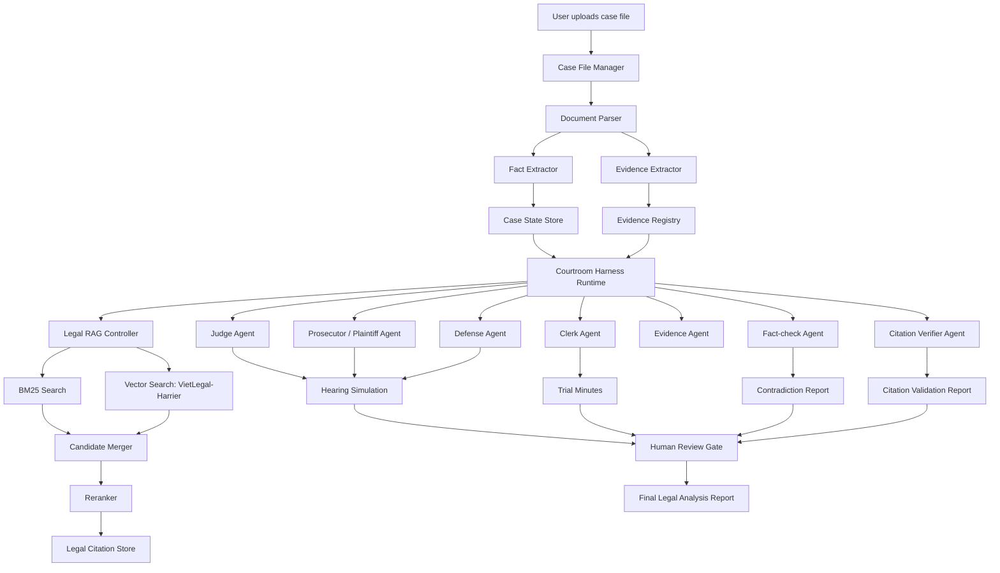

Dưới đây là bản **phác thảo cập nhật dạng Markdown** đã tích hợp dataset `th1nhng0/vietnamese-legal-documents` và embedding model `mainguyen9/vietlegal-harrier-0.6b`.

# AI Courtroom Harness

## 1. Project Overview

**AI Courtroom Harness** là một hệ thống mô phỏng và hỗ trợ phân tích phiên tòa bằng multi-agent AI.  
Thay vì chỉ xây một chatbot pháp luật, dự án xây một **harness layer** bao quanh các legal agents để kiểm soát:

- Vai trò của từng agent trong phiên tòa
- Quy trình tố tụng mô phỏng
- Hồ sơ vụ án
- Chứng cứ
- Truy xuất văn bản pháp luật bằng RAG
- Kiểm chứng citation
- Phát hiện hallucination
- Ghi log / audit trail
- Human review trước khi xuất kết luận

Ý tưởng chính:

> Orchestration giúp các agent phối hợp với nhau.  
> Harness giúp toàn bộ “phòng xử án AI” vận hành có quy trình, có kiểm chứng, có truy vết và an toàn hơn.

Dự án nên được định vị là:

> **Legal decision-support and courtroom simulation system**, không phải hệ thống thay thế thẩm phán hoặc tự động ra phán quyết pháp lý.

---

## 2. Core Idea

Mỗi chủ thể trong phiên tòa được mô hình hóa thành một agent:

- Judge Agent / Hội đồng xét xử
- Prosecutor Agent / Kiểm sát viên
- Defense Lawyer Agent / Luật sư bào chữa
- Plaintiff Agent / Nguyên đơn
- Defendant Agent / Bị đơn
- Clerk Agent / Thư ký phiên tòa
- Evidence Agent / Quản lý chứng cứ
- Legal Retrieval Agent / Truy xuất văn bản pháp luật
- Fact-checking Agent / Kiểm tra mâu thuẫn
- Citation Verifier Agent / Kiểm chứng điều luật

Harness đóng vai trò như “phòng xử án số”:

- Ai được nói ở bước nào?
- Agent nào được xem dữ liệu nào?
- Lập luận nào phải gắn với evidence ID?
- Điều luật nào phải có citation?
- Claim nào chưa đủ căn cứ?
- Có cần human review không?
- Toàn bộ quá trình có được ghi log không?

---

## 3. Why Harness Instead of Normal Multi-Agent?

Một hệ thống multi-agent thông thường có thể làm flow như sau:

```text
Prosecutor Agent → Defense Agent → Judge Agent → Final Summary
````

Nhưng nếu không có harness, hệ thống dễ gặp lỗi:

* Agent bịa luật
* Agent bịa chứng cứ
* Không phân biệt sự kiện và suy luận
* Không có audit trail
* Judge Agent kết luận quá sớm
* Không biết lập luận dựa trên văn bản pháp luật nào
* Không kiểm soát được vai trò từng agent
* Không có cơ chế human review

Vì vậy, AI Courtroom Harness cần thêm các lớp kiểm soát:

```text
Multi-Agent Orchestration
+ Legal RAG
+ Evidence Registry
+ Role Permission Manager
+ Citation Verifier
+ Fact-checking Layer
+ Audit Logger
+ Human Review Gate
= Courtroom Harness
```

---

## 4. Dataset

### 4.1 Primary Legal Corpus

Dataset chính đề xuất:

```text
th1nhng0/vietnamese-legal-documents
```

Đây là dataset văn bản pháp luật tiếng Việt, gồm:

* Laws
* Decrees
* Circulars
* Decisions
* Normative legal documents
* Metadata
* Full-text content
* Cross-document relationships

Theo mô tả dataset, nguồn dữ liệu được lấy từ `vbpl.vn`, tức Cổng thông tin văn bản quy phạm pháp luật do Bộ Tư pháp vận hành. Dataset có các config chính như `metadata`, `content`, `relationships` và `legacy`. Bản hiện tại có khoảng 153k metadata rows, 178k content rows và gần 898k relationship edges; bản legacy có khoảng 518k documents. 

Dataset này phù hợp cho dự án vì có:

```text
metadata:
- id
- title
- so_ky_hieu
- ngay_ban_hanh
- loai_van_ban
- ngay_co_hieu_luc
- ngay_het_hieu_luc
- nganh
- linh_vuc
- co_quan_ban_hanh
- tinh_trang_hieu_luc

content:
- id
- content_html

relationships:
- doc_id
- other_doc_id
- relationship
```

Dataset trên Hugging Face cũng được gắn tags như legal, Vietnamese, law, government, formats parquet và license CC BY 4.0. ([Hugging Face][1])

---

## 5. Embedding Model

### 5.1 Primary Embedding Model

Model đề xuất:

```text
mainguyen9/vietlegal-harrier-0.6b
```

Đây là Vietnamese legal domain embedding model, fine-tuned từ:

```text
microsoft/harrier-oss-v1-0.6b
```

Thông số chính:

```text
Model type: Sentence Transformer
Parameters: 600M
Embedding dimension: 1024
Max sequence length: 512 tokens
Similarity function: Cosine similarity
Language: Vietnamese
License: Apache 2.0
```

Theo model card, VietLegal-Harrier-0.6B đạt:

```text
NDCG@10   = 0.7813
MRR@10    = 0.7303
Recall@10 = 0.9321
```

trên benchmark Zalo AI Legal Text Retrieval / MTEB ZacLegalTextRetrieval, vượt các baseline như `vietlegal-e5`, `multilingual-e5-large`, `vietnamese-bi-encoder` và `halong_embedding`. ([Hugging Face][2])

Benchmark comparison:

```text
mainguyen9/vietlegal-harrier-0.6b   NDCG@10 0.7813
mainguyen9/vietlegal-e5             NDCG@10 0.7310
microsoft/harrier-oss-v1-0.6b       NDCG@10 0.7210
intfloat/multilingual-e5-large      NDCG@10 0.6660
bkai/vietnamese-bi-encoder          NDCG@10 0.6160
contextboxai/halong_embedding       NDCG@10 0.6009
```

Vì model này được fine-tune trực tiếp trên legal retrieval tiếng Việt, nó rất phù hợp để làm embedding backbone cho Legal RAG trong AI Courtroom Harness.

---

## 6. Embedding Usage

Vì Harrier dùng instruction-based queries, query nên có format:

```python
from sentence_transformers import SentenceTransformer

model = SentenceTransformer("mainguyen9/vietlegal-harrier-0.6b")

queries = [
    "Instruct: Given a Vietnamese legal question, retrieve relevant legal passages that answer the question\nQuery: Thủ tục đăng ký kinh doanh gồm những bước nào?"
]

passages = [
    "Điều 27. Trình tự, thủ tục đăng ký doanh nghiệp..."
]

q_emb = model.encode(queries)
p_emb = model.encode(passages)

similarity = q_emb @ p_emb.T
```

Trong hệ thống thật, nên chuẩn hóa query theo template:

```text
Instruct: Given a Vietnamese legal question, retrieve relevant legal passages that answer the question
Query: {legal_question}
```

Ví dụ:

```text
Instruct: Given a Vietnamese legal question, retrieve relevant legal passages that answer the question
Query: Bị cáo gây thương tích 35% thì có thể áp dụng điều luật nào?
```

---

## 7. RAG Pipeline

### 7.1 Legal Document Processing

Input:

```text
th1nhng0/vietnamese-legal-documents
```

Pipeline xử lý:

```text
Load metadata
→ Load content
→ Clean HTML
→ Join metadata + content by document id
→ Split document by article-aware segmentation
→ Attach metadata
→ Embed chunks using vietlegal-harrier-0.6b
→ Store in vector database
```

### 7.2 Chunking Strategy

Không nên chunk văn bản pháp luật theo fixed token thuần túy.
Nên chunk theo cấu trúc pháp lý:

```text
Văn bản
→ Chương
→ Mục
→ Điều
→ Khoản
→ Điểm
```

Schema chunk đề xuất:

```json
{
  "chunk_id": "LAW_CHUNK_000001",
  "doc_id": "12345",
  "title": "Bộ luật Hình sự 2015",
  "so_ky_hieu": "100/2015/QH13",
  "loai_van_ban": "Bộ luật",
  "ngay_ban_hanh": "27/11/2015",
  "ngay_co_hieu_luc": "01/01/2018",
  "ngay_het_hieu_luc": "",
  "tinh_trang_hieu_luc": "Còn hiệu lực",
  "co_quan_ban_hanh": "Quốc hội",
  "linh_vuc": "Hình sự",
  "article": "Điều 134",
  "clause": "Khoản 1",
  "content": "...",
  "source": "vbpl.vn"
}
```

---

## 8. Retrieval Design

Legal retrieval nên dùng hybrid search:

```text
Vector Search
+ BM25 Keyword Search
+ Metadata Filtering
+ Reranking
```

### 8.1 Vector Search

Dùng:

```text
mainguyen9/vietlegal-harrier-0.6b
```

Để retrieve semantic relevant passages.

### 8.2 BM25 Search

Dùng BM25 để bắt các keyword pháp lý quan trọng:

```text
- Điều 134
- khoản 2
- cố ý gây thương tích
- trách nhiệm bồi thường
- hợp đồng dân sự
- nghĩa vụ giao tài sản
```

### 8.3 Metadata Filtering

Dùng metadata từ dataset để filter:

```text
- lĩnh vực pháp luật
- loại văn bản
- cơ quan ban hành
- tình trạng hiệu lực
- ngày có hiệu lực
- ngày hết hiệu lực
```

Ví dụ:

```json
{
  "linh_vuc": "Hình sự",
  "tinh_trang_hieu_luc": "Còn hiệu lực",
  "loai_van_ban": ["Bộ luật", "Nghị quyết", "Thông tư"]
}
```

### 8.4 Reranking

Pipeline đề xuất:

```text
User legal question
→ Query rewriting
→ BM25 top 50
→ Vector search top 50
→ Merge candidates
→ Rerank top 20
→ Select top 3-5 legal passages
→ Citation verifier
→ Answer generation
```

---

## 9. Courtroom Harness Architecture



---

## 10. Core Harness Components

### 10.1 Role Permission Manager

Quản lý quyền của từng agent.

Ví dụ:

```text
Legal Retrieval Agent:
- Được truy xuất legal corpus
- Không được tự kết luận đúng/sai cuối cùng

Evidence Agent:
- Được extract evidence từ hồ sơ
- Không được tự thêm chứng cứ không có nguồn

Defense Agent:
- Được phản biện claim
- Phải gắn phản biện với evidence ID hoặc legal citation

Judge Agent:
- Được tổng hợp lập luận
- Không được kết luận nếu thiếu citation/evidence
```

---

### 10.2 Case State Manager

Lưu trạng thái vụ án:

```json
{
  "case_id": "CASE_001",
  "case_type": "criminal",
  "facts": [],
  "evidence_ids": [],
  "legal_issues": [],
  "claims": [],
  "citations": [],
  "agent_turns": [],
  "status": "in_simulation"
}
```

---

### 10.3 Evidence Registry

Mọi chứng cứ phải có ID.

```json
{
  "evidence_id": "EVID_003",
  "type": "witness_statement",
  "content": "Nhân chứng A khai rằng bị cáo có mặt tại hiện trường lúc 20:00.",
  "source": "case_file_page_4",
  "status": "disputed",
  "used_by": ["prosecutor_agent"],
  "challenged_by": ["defense_agent"]
}
```

Harness rule:

```text
Nếu agent đưa ra claim về sự kiện nhưng không gắn evidence_id
→ mark unsupported_claim = true
→ yêu cầu agent sửa lại hoặc chuyển sang human review
```

---

### 10.4 Legal Citation Verifier

Mọi citation phải đến từ Legal RAG.

```json
{
  "citation_id": "LAW_001",
  "doc_id": "12345",
  "title": "Bộ luật Hình sự 2015",
  "article": "Điều 134",
  "clause": "Khoản 1",
  "content": "...",
  "retrieval_score": 0.84,
  "source": "th1nhng0/vietnamese-legal-documents"
}
```

Harness rule:

```text
Nếu agent viện dẫn điều luật không nằm trong retrieved citations
→ reject citation

Nếu citation có tồn tại nhưng không hỗ trợ claim
→ mark weak_support

Nếu văn bản hết hiệu lực
→ warning: possible outdated legal basis

Nếu không xác định được tình trạng hiệu lực
→ require human review
```

---

### 10.5 Audit Logger

Ghi lại mọi hành động của agent:

```json
{
  "turn_id": "TURN_014",
  "agent": "defense_agent",
  "message": "...",
  "claims": ["CLAIM_003"],
  "evidence_used": ["EVID_002"],
  "citations_used": ["LAW_001"],
  "status": "needs_fact_check"
}
```

---

## 11. Agent Design

### 11.1 Judge Agent

Nhiệm vụ:

* Điều phối phiên tòa mô phỏng
* Đặt câu hỏi làm rõ
* Tổng hợp điểm tranh chấp
* Chỉ ra vấn đề cần human review
* Không tự ra phán quyết pháp lý cuối cùng

Output format:

```json
{
  "summary": "...",
  "main_disputed_points": [],
  "questions_to_clarify": [],
  "unsupported_claims": [],
  "recommended_human_review": true
}
```

---

### 11.2 Prosecutor / Plaintiff Agent

Nhiệm vụ:

* Trình bày cáo buộc hoặc yêu cầu
* Dùng chứng cứ có lợi
* Gắn claim với evidence ID
* Gắn lập luận pháp lý với citation ID

Output format:

```json
{
  "claims": [
    {
      "claim_id": "CLAIM_001",
      "content": "...",
      "evidence_ids": ["EVID_001"],
      "citation_ids": ["LAW_001"],
      "confidence": "medium"
    }
  ]
}
```

---

### 11.3 Defense Agent

Nhiệm vụ:

* Phản biện claim
* Chỉ ra chứng cứ yếu
* Chỉ ra citation không phù hợp
* Đề xuất câu hỏi đối chất
* Nêu tình tiết giảm nhẹ hoặc căn cứ bác bỏ

---

### 11.4 Legal Retrieval Agent

Nhiệm vụ:

* Nhận legal issue
* Rewrite query
* Search BM25 + vector
* Rerank
* Trả về top legal passages

Example input:

```text
Bị cáo gây thương tích 35% thì có thể áp dụng điều luật nào?
```

Rewritten query:

```text
cố ý gây thương tích tỷ lệ tổn thương cơ thể 35% trách nhiệm hình sự khung hình phạt
```

Output:

```json
{
  "legal_issue": "Cố ý gây thương tích",
  "retrieved_citations": [
    {
      "citation_id": "LAW_001",
      "title": "...",
      "article": "...",
      "content": "...",
      "score": 0.87
    }
  ]
}
```

---

### 11.5 Fact-check Agent

Nhiệm vụ:

* Kiểm tra mâu thuẫn giữa facts, evidence và claims
* Flag unsupported claim
* Flag overclaiming
* Flag citation mismatch

Output:

```json
{
  "unsupported_claims": [],
  "contradictions": [],
  "citation_mismatches": [],
  "risk_level": "medium"
}
```

---

### 11.6 Clerk Agent

Nhiệm vụ:

* Ghi biên bản phiên tòa mô phỏng
* Tóm tắt từng lượt phát biểu
* Ghi lại claim, evidence, citation
* Xuất trial minutes

---

## 12. System Workflow

```text
1. User uploads case file
2. System parses case file
3. Evidence Agent extracts evidence
4. Case State Manager stores facts/evidence
5. Legal Issue Classifier identifies legal issues
6. Legal Retrieval Agent retrieves relevant legal passages
7. Prosecutor/Plaintiff Agent presents arguments
8. Defense Agent responds
9. Fact-check Agent validates claims
10. Citation Verifier checks legal basis
11. Judge Agent summarizes disputed points
12. Clerk Agent generates trial minutes
13. Human Review Gate checks high-risk output
14. Final report is generated
```

---

## 13. Recommended Tech Stack

### Frontend

```text
React
TypeScript
Tailwind CSS
shadcn/ui
```

UI layout:

```text
Left panel: Case file / evidence
Center panel: Courtroom simulation
Right panel: Legal citations / RAG sources
Bottom panel: Judge summary / audit log
```

### Backend

```text
Python
FastAPI
Pydantic
LangGraph
SQLAlchemy
```

### RAG

```text
Embedding model:
- mainguyen9/vietlegal-harrier-0.6b

Vector database:
- FAISS for local MVP
- Qdrant for production-style version

Keyword search:
- BM25
- Elasticsearch / OpenSearch if scaling

Reranker:
- bge-reranker-v2-m3
- or another multilingual/legal reranker
```

### Storage

```text
PostgreSQL:
- cases
- evidence
- claims
- citations
- agent turns
- audit logs

Object storage:
- uploaded PDFs
- parsed text
- generated reports
```

### LLM

MVP options:

```text
API-based:
- GPT-4.1 / GPT-4o / GPT-5.x
- Claude Sonnet
- Gemini Pro

Open-source:
- Qwen2.5 / Qwen3 Instruct
- Llama 3.1 / 3.3 Instruct
- Vistral / Vietnamese-oriented LLM if needed
```

Important:

> Không cần fine-tune LLM ngay. Với legal domain, ưu tiên RAG, citation verification, evidence grounding và harness trước.

---

## 14. Harness Inspiration

### 14.1 Hermes Agent

Có thể tham khảo:

```text
NousResearch/hermes-agent
```

Ý tưởng có thể học từ Hermes Agent:

* Skill system
* Tool runtime
* Memory
* Session persistence
* Context references
* MCP server management
* Reliability / recovery loop

Mapping sang AI Courtroom Harness:

```text
Hermes Agent Concept        → AI Courtroom Harness
--------------------------------------------------
Skill system                → Legal reasoning skills
Tool use                    → Legal RAG / evidence tools
Memory                      → Case memory / legal issue memory
Context references          → evidence_id / citation_id
MCP tools                   → legal search, file parser, verifier
Self-improvement loop       → improve prompts / retrieval / citations
Reliability fixes           → guardrails and validation
```

Repo Hermes Agent được mô tả là agent có learning loop, skill creation, memory, tool use và session persistence; các release gần đây cũng nhắc đến API server, messaging adapters, MCP server management, context references, prompt caching và reliability fixes. ([Hugging Face][2])

---

## 15. MVP Scope

### MVP Features

```text
1. Upload hoặc nhập case file dạng text
2. Extract facts
3. Extract evidence
4. Retrieve relevant legal passages
5. Simulate prosecutor/plaintiff argument
6. Simulate defense response
7. Fact-check claims
8. Verify citations
9. Judge Agent summarizes disputed points
10. Export final markdown report
```

### MVP Case Type

Nên bắt đầu với **vụ việc dân sự / hợp đồng đơn giản** thay vì hình sự.

Ví dụ:

```text
Case: Tranh chấp hợp đồng mua bán tài sản

Facts:
- A bán cho B một chiếc xe máy.
- B đã thanh toán 70%.
- A chưa giao xe đúng hạn.
- A cho rằng B chưa thanh toán đủ nên chưa giao.
- B yêu cầu giao xe hoặc hoàn tiền và bồi thường.

Evidence:
- Hợp đồng mua bán
- Biên nhận chuyển khoản
- Tin nhắn giữa A và B
- Thời hạn giao xe
```

Lý do chọn case dân sự:

* Ít rủi ro hơn hình sự
* Dễ mô phỏng
* Dễ kiểm tra nghĩa vụ, vi phạm, bồi thường
* Phù hợp làm demo portfolio

---

## 16. MVP Roadmap

### Week 1: Legal RAG

Tasks:

```text
- Load th1nhng0/vietnamese-legal-documents
- Clean HTML content
- Join metadata + content
- Chunk by article-aware segmentation
- Embed chunks using vietlegal-harrier-0.6b
- Store in FAISS or Qdrant
- Build /legal-search API
```

Output:

```text
Legal Retrieval Agent hoạt động được.
```

---

### Week 2: Case File and Evidence Registry

Tasks:

```text
- Build case upload/input UI
- Parse case text
- Extract facts
- Extract evidence
- Assign evidence_id
- Store evidence in database
- Display evidence table in UI
```

Output:

```text
Case File Manager + Evidence Registry.
```

---

### Week 3: Multi-Agent Courtroom Simulation

Tasks:

```text
- Build Judge Agent
- Build Plaintiff/Prosecutor Agent
- Build Defense Agent
- Build Clerk Agent
- Orchestrate using LangGraph
- Force agents to use evidence_id and citation_id
```

Output:

```text
Courtroom simulation flow.
```

---

### Week 4: Harness, Guardrails, and Report

Tasks:

```text
- Add Citation Verifier
- Add Unsupported Claim Detector
- Add Role Permission Manager
- Add Audit Logger
- Add Human Review Gate
- Export markdown/pdf report
```

Output:

```text
AI Courtroom Harness MVP.
```

---

## 17. Evaluation Plan

### 17.1 Retrieval Evaluation

Metrics:

```text
Recall@10
MRR@10
NDCG@10
Citation correctness
Top-k legal passage relevance
```

Because `vietlegal-harrier-0.6b` already reports strong scores on Vietnamese legal text retrieval, it can be used as the main embedding baseline for the project. ([Hugging Face][3])

### 17.2 Agent Evaluation

Evaluate:

```text
- Agent có giữ đúng vai trò không?
- Lập luận có gắn evidence_id không?
- Điều luật có gắn citation_id không?
- Có bịa luật không?
- Có bịa chứng cứ không?
- Có phát hiện mâu thuẫn không?
- Judge summary có cân bằng hai phía không?
```

### 17.3 Harness Evaluation

Test cases:

```text
Test 1:
Agent viện dẫn điều luật không tồn tại.
Expected:
Citation Verifier reject.

Test 2:
Defense Agent thêm chứng cứ không có trong hồ sơ.
Expected:
Evidence Registry reject.

Test 3:
Prosecutor Agent kết luận vượt quá chứng cứ.
Expected:
Fact-check Agent flags unsupported claim.

Test 4:
RAG trả văn bản hết hiệu lực.
Expected:
Harness warns outdated legal basis.

Test 5:
Claim không có evidence_id.
Expected:
Harness marks unsupported_claim = true.
```

---

## 18. Final Report Format

Output cuối cùng nên là markdown:

```md
# Courtroom Simulation Report

## 1. Case Summary

## 2. Extracted Facts

## 3. Evidence Table

| Evidence ID | Type | Content | Source | Status |
|------------|------|---------|--------|--------|

## 4. Legal Issues

## 5. Retrieved Legal Citations

| Citation ID | Document | Article | Status | Relevance |
|-------------|----------|---------|--------|-----------|

## 6. Plaintiff / Prosecutor Arguments

## 7. Defense Arguments

## 8. Fact-checking Results

## 9. Disputed Points

## 10. Judge Agent Preliminary Analysis

## 11. Human Review Checklist

## 12. Disclaimer

This system is for legal education, simulation, and research support only. It does not provide official legal advice or replace qualified legal professionals.
```

---

## 19. Key Differentiation

Dự án khác chatbot pháp luật thông thường ở các điểm:

```text
1. Multi-agent courtroom simulation
2. Legal-domain Vietnamese embedding model
3. Article-aware legal RAG
4. Evidence-grounded argument generation
5. Citation verification
6. Role-based permission control
7. Audit trail
8. Human review gate
9. Harness-first architecture
```

Điểm nổi bật nhất:

> Hệ thống không chỉ trả lời câu hỏi pháp luật, mà mô phỏng quy trình tranh tụng có kiểm soát, trong đó mọi lập luận phải được grounding bằng chứng cứ và văn bản pháp luật.

---

## 20. Suggested Project Name

```text
AI Courtroom Harness
```

Tên đầy đủ:

```text
AI Courtroom Harness: A Multi-Agent Legal Reasoning Environment for Vietnamese Courtroom Simulation
```

Tên tiếng Việt:

```text
AI Courtroom Harness: Khung vận hành đa tác tử cho mô phỏng và hỗ trợ phân tích phiên tòa tiếng Việt
```

---

## 21. One-paragraph Proposal

**AI Courtroom Harness** is a Vietnamese legal multi-agent system for courtroom simulation and legal reasoning support. The system models courtroom participants such as judge, prosecutor, defense lawyer, clerk, evidence manager, legal retrieval agent, and fact-checking agent. Instead of relying on a single legal chatbot, the project introduces a harness layer that controls role permissions, procedural workflow, evidence grounding, legal citation verification, audit logging, memory, and human review. The system uses the `th1nhng0/vietnamese-legal-documents` dataset as its legal corpus and `mainguyen9/vietlegal-harrier-0.6b`, a Vietnamese legal-domain embedding model with strong retrieval performance, as the core embedding model for RAG. The goal is to support legal education, courtroom simulation, and legal AI research, not to replace human legal professionals or judicial decision-making.

---

## 22. Recommended Initial Implementation

Recommended stack for the first working version:

```text
Frontend:
- React
- TypeScript
- Tailwind CSS
- shadcn/ui

Backend:
- FastAPI
- LangGraph
- Pydantic
- PostgreSQL

RAG:
- th1nhng0/vietnamese-legal-documents
- mainguyen9/vietlegal-harrier-0.6b
- FAISS for MVP
- Qdrant for scalable version
- BM25 hybrid search
- Optional reranker

LLM:
- GPT/Claude/Gemini API for MVP
- Qwen/Llama/Vietnamese LLM for open-source experiments

Harness:
- Role Permission Manager
- Case State Manager
- Evidence Registry
- Legal RAG Controller
- Citation Verifier
- Fact-check Agent
- Audit Logger
- Human Review Gate
```

Lưu ý nhỏ: với dataset pháp luật, dù dataset có metadata `tinh_trang_hieu_luc`, hệ thống vẫn nên hiển thị cảnh báo rằng đây là snapshot và cần đối chiếu nguồn chính thức trước khi dùng trong bối cảnh pháp lý thật.
::contentReference[oaicite:5]{index=5}

[1]: https://huggingface.co/datasets/th1nhng0/vietnamese-legal-documents/discussions?utm_source=chatgpt.com "th1nhng0/vietnamese-legal-documents · Discussions"
[2]: https://huggingface.co/mainguyen9/vietlegal-harrier-0.6b?utm_source=chatgpt.com "mainguyen9/vietlegal-harrier-0.6b"
[3]: https://huggingface.co/mainguyen9/vietlegal-harrier-0.6b/raw/main/README.md?utm_source=chatgpt.com "raw"
